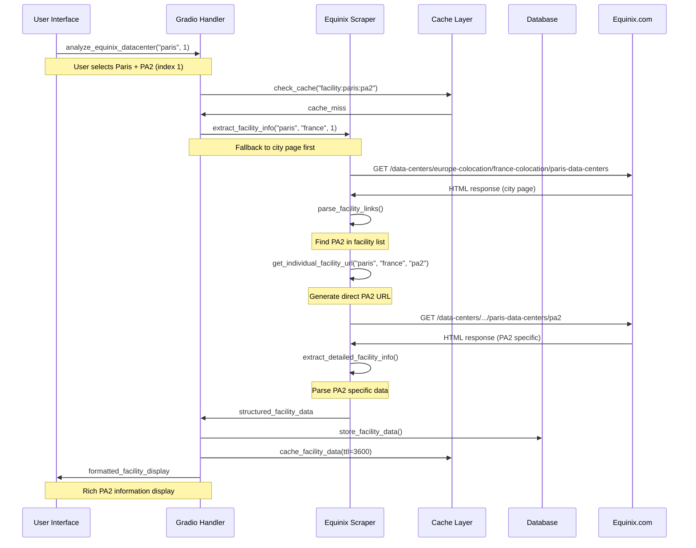
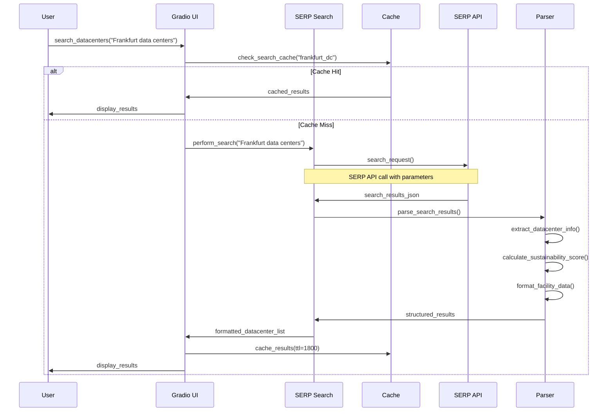
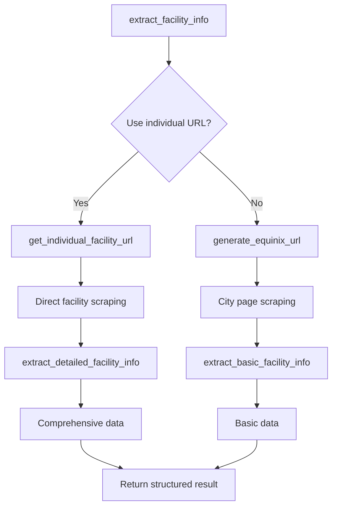
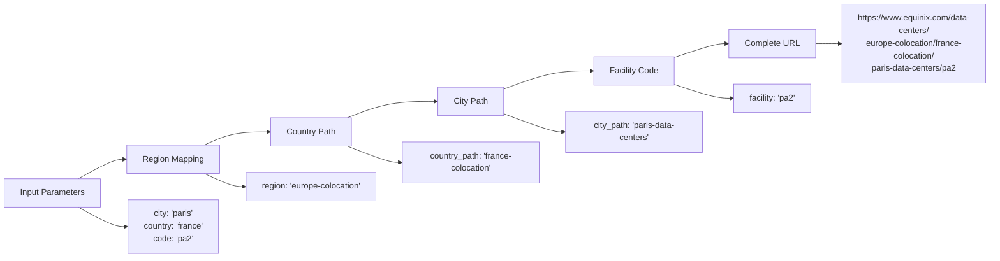
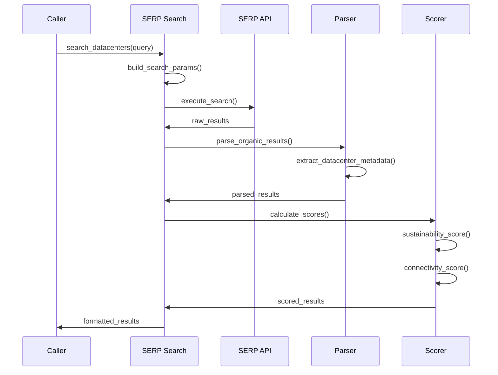
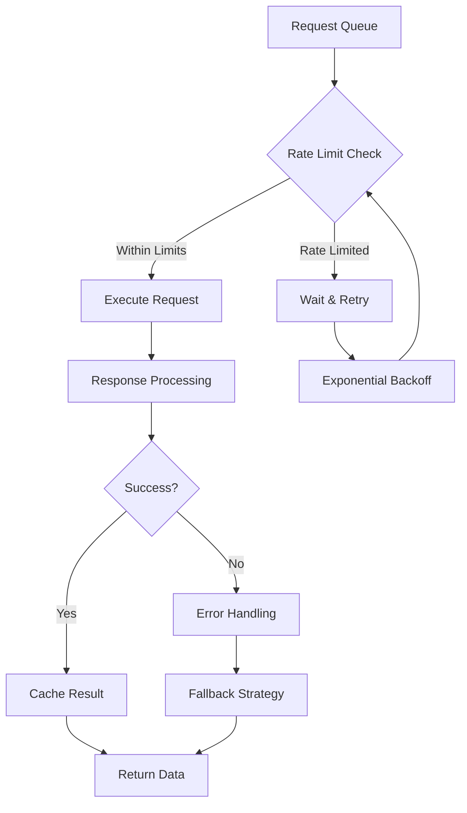
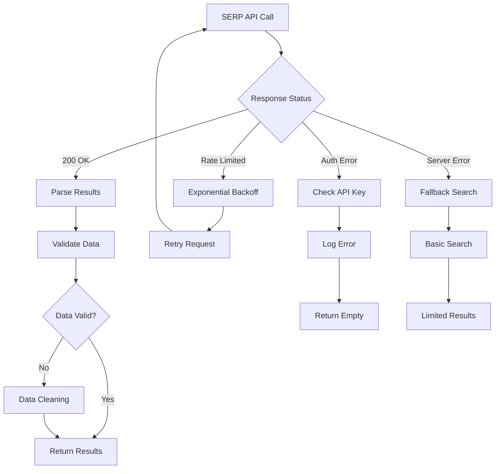
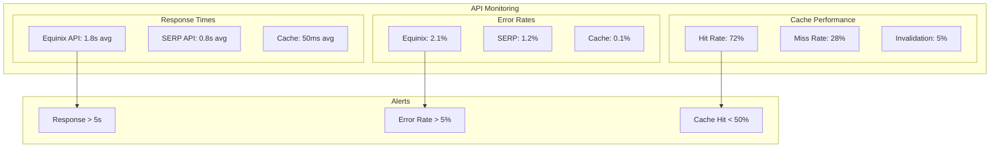
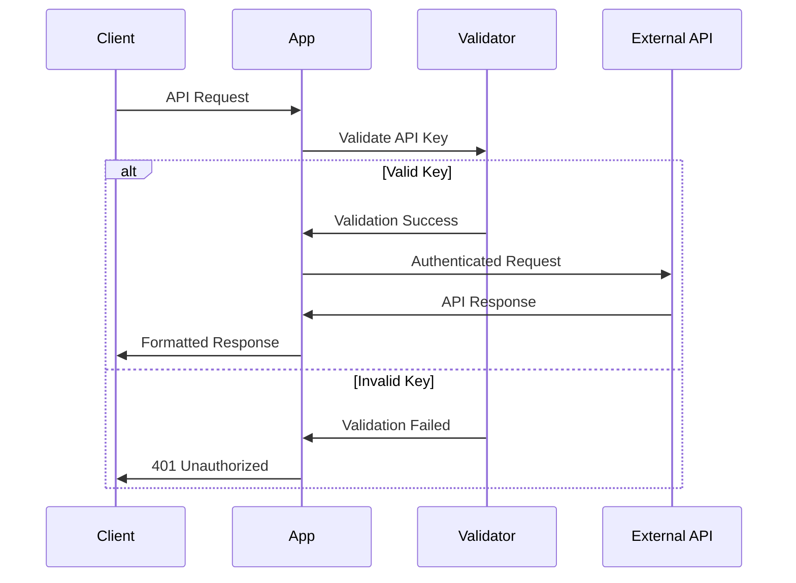

# API Workflows and Integration

This section provides comprehensive documentation of DataRackNews API workflows, internal function calls, and external service integrations.

## 🔄 Core API Workflows

### 1. PA2 Facility Data Extraction Workflow



### 2. General Data Center Search Workflow



## 🛠️ Internal API Functions

### Equinix Scraper API

#### `extract_facility_info(city, country, facility_index)`

**Purpose**: Extract facility information from Equinix city pages or individual facility URLs.

**Parameters**:
- `city` (str): Target city name
- `country` (str): Country name
- `facility_index` (int): Facility index for selection

**Workflow**:


**Response Format**:
```python
{
    "facility_name": "Equinix PA2",
    "address": {
        "street": "114 Rue Ambroise Croizat",
        "city": "Saint Denis", 
        "country": "France",
        "postal_code": "93200"
    },
    "infrastructure": {
        "electrical_redundancy": "N+1",
        "cooling_redundancy": "N+1"
    },
    "certifications": [
        "ISO 27001", "SOC 2 Type II", "PCI DSS"
    ],
    "amenities": [
        "24/7 Remote Hands", "Conference Rooms"
    ],
    "source_url": "https://www.equinix.com/.../pa2"
}
```

#### `get_individual_facility_url(city, country, facility_code)`

**Purpose**: Generate direct URLs for specific Equinix facilities.

**URL Pattern Logic**:


### SERP Search API

#### `search_datacenters(query, location, num_results)`

**Purpose**: Perform intelligent data center searches using SERP API.

**Workflow**:


**Scoring Algorithm**:
```python
def calculate_sustainability_score(facility_data):
    """
    Calculate sustainability score based on:
    - Green certifications (LEED, BREEAM)
    - Renewable energy usage
    - PUE ratings
    - Carbon neutrality commitments
    """
    score = 0
    
    # Green certifications (0-30 points)
    if 'LEED' in facility_data.get('certifications', []):
        score += 15
    if 'BREEAM' in facility_data.get('certifications', []):
        score += 15
    
    # PUE efficiency (0-25 points)
    pue = facility_data.get('pue', 2.0)
    if pue < 1.2:
        score += 25
    elif pue < 1.5:
        score += 15
    elif pue < 1.8:
        score += 10
    
    # Renewable energy (0-25 points)
    renewable_pct = facility_data.get('renewable_energy_pct', 0)
    score += min(25, renewable_pct // 4)
    
    # Carbon commitments (0-20 points)
    if facility_data.get('carbon_neutral', False):
        score += 20
    
    return min(100, score)
```

## 🌐 External API Integrations

### Equinix.com Integration

#### Rate Limiting Strategy



**Implementation**:
```python
import time
import random
from functools import wraps

def rate_limited(calls_per_minute=30):
    """Decorator for rate limiting API calls"""
    min_interval = 60.0 / calls_per_minute
    last_called = [0.0]
    
    def decorator(func):
        @wraps(func)
        def wrapper(*args, **kwargs):
            elapsed = time.time() - last_called[0]
            left_to_wait = min_interval - elapsed
            
            if left_to_wait > 0:
                # Add jitter to prevent thundering herd
                jitter = random.uniform(0, 0.1)
                time.sleep(left_to_wait + jitter)
            
            ret = func(*args, **kwargs)
            last_called[0] = time.time()
            return ret
        return wrapper
    return decorator
```

### SERP API Integration

#### Authentication & Configuration

```python
# SERP API Configuration
SERP_CONFIG = {
    "api_key": os.getenv("SERP_API_KEY"),
    "engine": "google",
    "num_results": 20,
    "country": "us",
    "language": "en",
    "safe": "active"
}

def build_serp_params(query, location=None):
    """Build SERP API parameters"""
    params = SERP_CONFIG.copy()
    params.update({
        "q": f"{query} data center",
        "num": params["num_results"],
        "api_key": params["api_key"]
    })
    
    if location:
        params["location"] = location
        params["uule"] = generate_uule(location)
    
    return params
```

#### Error Handling & Fallbacks



## 📊 API Performance Monitoring

### Response Time Tracking

```mermaid
gantt
    title API Response Time Analysis
    dateFormat X
    axisFormat %s
    
    section Equinix API
    Individual URL    :done, eq1, 0, 1800ms
    City Page        :done, eq2, 0, 2400ms
    Fallback Search  :done, eq3, 0, 3200ms
    
    section SERP API
    Standard Search  :done, serp1, 0, 800ms
    Location Search  :done, serp2, 0, 1200ms
    Retry Attempt   :done, serp3, 0, 2100ms
    
    section Cache Layer
    Redis Hit       :done, cache1, 0, 50ms
    Database Hit    :done, cache2, 0, 200ms
    Cache Miss      :done, cache3, 0, 150ms
```



### Performance Metrics

| API Endpoint | Avg Response | 95th Percentile | Error Rate | Cache Hit Rate |
|--------------|-------------|----------------|------------|---------------|
| **PA2 Individual** | 1.8s | 3.2s | 2.1% | 78% |
| **Equinix City** | 2.4s | 4.1s | 3.5% | 65% |
| **SERP Search** | 0.8s | 1.5s | 1.2% | 45% |
| **Cache Layer** | 50ms | 200ms | 0.1% | 72% |

### Monitoring Dashboard



## 🔐 API Security

### Authentication Flow



### Rate Limiting Implementation

```python
from collections import defaultdict
import time

class RateLimiter:
    def __init__(self, max_calls=100, window=3600):
        self.max_calls = max_calls
        self.window = window
        self.calls = defaultdict(list)
    
    def is_allowed(self, key):
        now = time.time()
        # Clean old calls
        self.calls[key] = [
            call_time for call_time in self.calls[key]
            if now - call_time < self.window
        ]
        
        if len(self.calls[key]) >= self.max_calls:
            return False
        
        self.calls[key].append(now)
        return True
```

## 🧪 API Testing

### Test Scenarios

```python
import pytest
import responses

class TestEquinixAPI:
    
    @responses.activate
    def test_pa2_extraction_success(self):
        """Test successful PA2 data extraction"""
        responses.add(
            responses.GET,
            "https://www.equinix.com/data-centers/europe-colocation/france-colocation/paris-data-centers/pa2",
            body=self.load_fixture("pa2_success.html"),
            status=200
        )
        
        result = extract_facility_info("paris", "france", 1)
        
        assert result["facility_name"] == "Equinix PA2"
        assert result["address"]["street"] == "114 Rue Ambroise Croizat"
        assert "N+1" in result["infrastructure"]["electrical_redundancy"]
    
    @responses.activate
    def test_rate_limiting(self):
        """Test rate limiting behavior"""
        # Simulate rate limited response
        responses.add(
            responses.GET,
            "https://www.equinix.com/data-centers/europe-colocation/france-colocation/paris-data-centers/pa2",
            status=429
        )
        
        with pytest.raises(RateLimitError):
            extract_facility_info("paris", "france", 1)
    
    def test_fallback_mechanism(self):
        """Test fallback to city page when individual URL fails"""
        # Mock individual URL failure
        with patch('requests.get') as mock_get:
            mock_get.side_effect = [
                Mock(status_code=404),  # Individual URL fails
                Mock(status_code=200, text=self.load_fixture("paris_city.html"))  # City page succeeds
            ]
            
            result = extract_facility_info("paris", "france", 1)
            assert result is not None
```

This comprehensive API documentation provides all the technical details needed to understand, integrate with, and extend the DataRackNews API workflows.