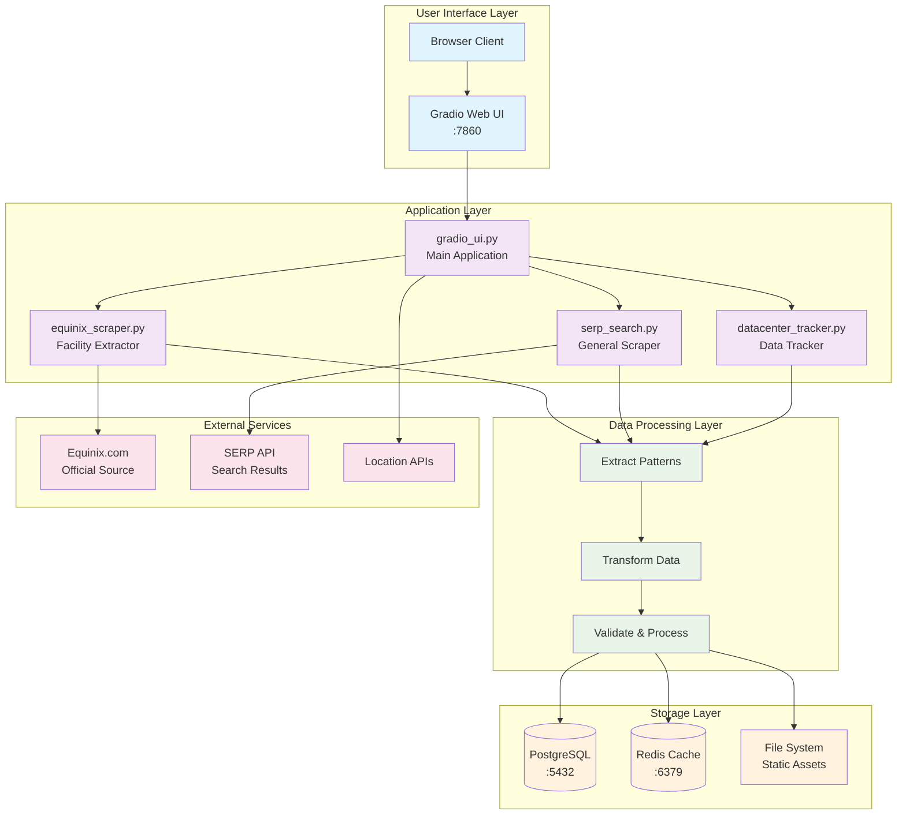
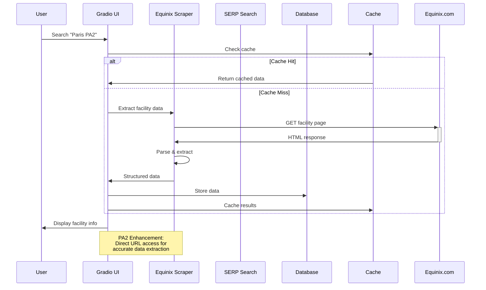
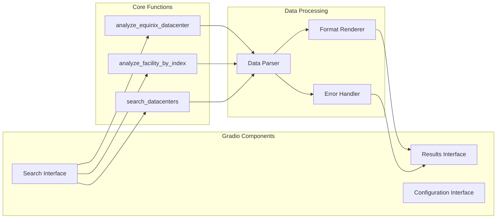
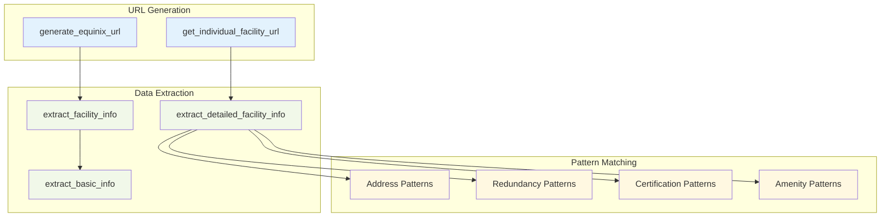
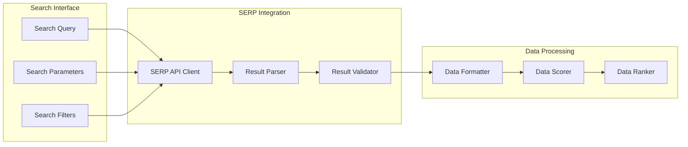
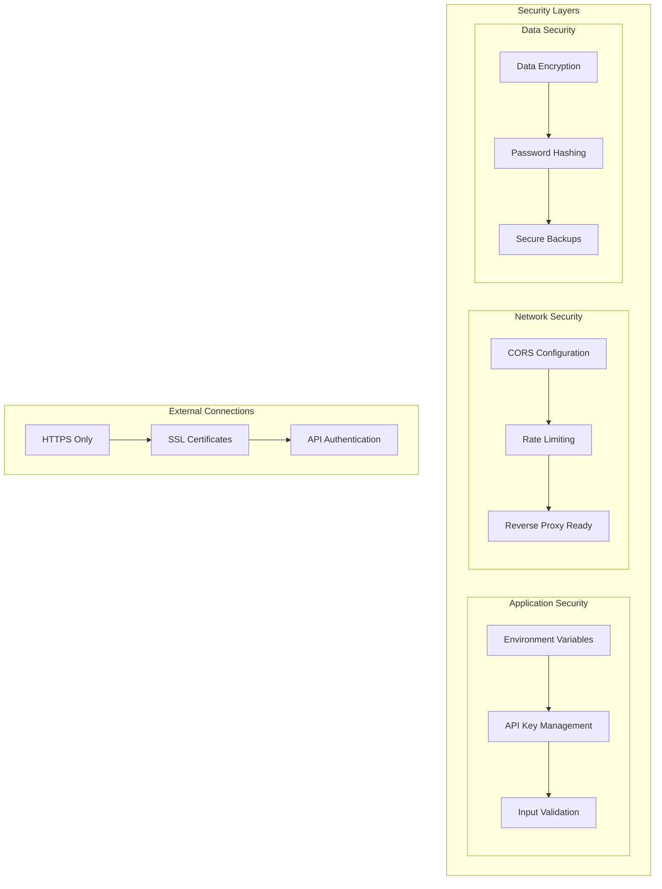
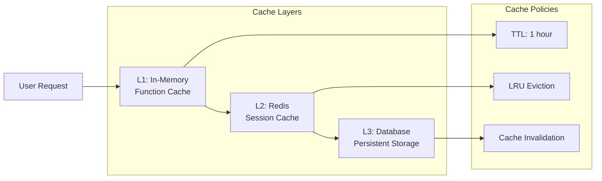
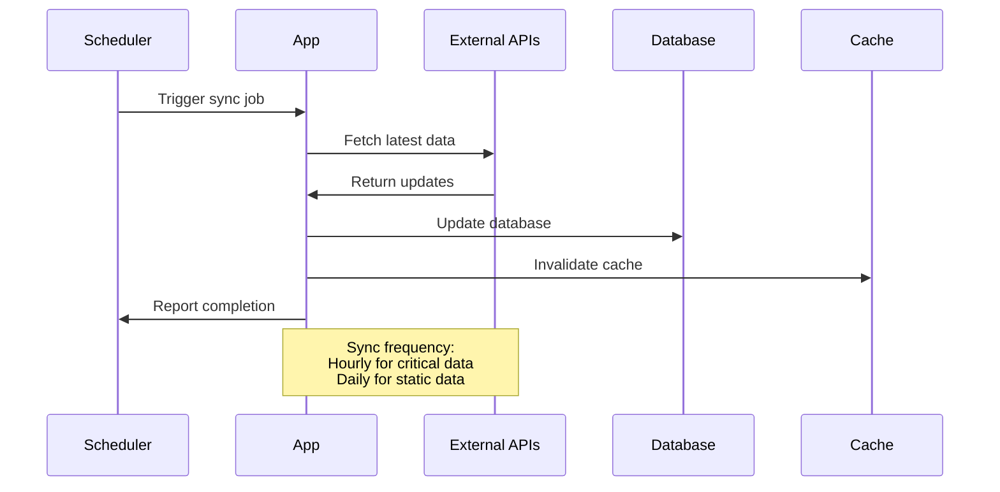

# System Overview

DataRackNews is built on a modern, containerized architecture that provides real-time data center intelligence through sophisticated web scraping and data processing capabilities.

## 🏗️ High-Level Architecture



## 🔄 Data Flow Architecture



## 🏢 Component Architecture

### Core Components

#### 1. Gradio Web Interface (`gradio_ui.py`)



**Key Features:**
- Interactive search interface with location and facility dropdowns
- Real-time facility analysis with comprehensive data display
- Error handling and user feedback systems
- Responsive design with modern UI components

#### 2. Equinix Scraper (`equinix_scraper.py`)



**Enhanced PA2 Capabilities:**
- Direct facility URL access: `https://www.equinix.com/data-centers/europe-colocation/france-colocation/paris-data-centers/pa2`
- Comprehensive pattern matching for all data fields
- Intelligent fallback mechanisms
- Rate limiting and error handling

#### 3. General Search Engine (`serp_search.py`)



## 🐳 Docker Architecture

```mermaid
graph TB
    subgraph "Docker Environment"
        subgraph "Application Container"
            APP[DataRackNews App<br/>Python 3.11]
            GRAD[Gradio Server<br/>:7860]
        end
        
        subgraph "Database Container"
            PG[PostgreSQL 15<br/>:5432]
            PGDATA[/var/lib/postgresql/data]
        end
        
        subgraph "Cache Container"
            REDIS[Redis 7<br/>:6379]
            REDISDATA[/data]
        end
        
        subgraph "Volumes"
            APPVOL[app_data]
            PGVOL[postgres_data]
            REDISVOL[redis_data]
        end
    end
    
    subgraph "Host System"
        HOST[Host Machine]
        BROWSER[Browser :7860]
    end
    
    APP --> GRAD
    GRAD --> PG
    GRAD --> REDIS
    
    APPVOL --> APP
    PGVOL --> PGDATA
    REDISVOL --> REDISDATA
    
    HOST --> BROWSER
    BROWSER --> GRAD
    
    classDef container fill:#e3f2fd
    classDef volume fill:#f1f8e9
    classDef host fill:#fff3e0
    
    class APP,GRAD,PG,REDIS container
    class APPVOL,PGVOL,REDISVOL,PGDATA,REDISDATA volume
    class HOST,BROWSER host
```

### Container Specifications

| Container | Base Image | Ports | Volumes | Purpose |
|-----------|------------|-------|---------|---------|
| **app** | python:3.11-slim | 7860:7860 | ./:/app | Main application |
| **postgres** | postgres:15 | 5432:5432 | postgres_data:/var/lib/postgresql/data | Database |
| **redis** | redis:7-alpine | 6379:6379 | redis_data:/data | Caching |

## 🔐 Security Architecture



## 📊 Performance Architecture

### Caching Strategy



### Scalability Design

- **Horizontal Scaling**: Multiple app containers behind load balancer
- **Vertical Scaling**: Resource allocation via Docker Compose
- **Database Scaling**: Read replicas and connection pooling
- **Cache Scaling**: Redis cluster for high availability

## 🔄 Integration Points

### External APIs

| Service | Purpose | Rate Limits | Fallback |
|---------|---------|-------------|----------|
| **Equinix.com** | Primary facility data | Respectful delays | Cache + Manual |
| **SERP API** | Search intelligence | API key limits | Basic search |
| **Maps API** | Geolocation data | Standard limits | Static coordinates |

### Data Synchronization



This architecture ensures reliable, scalable, and maintainable data center intelligence with a focus on the enhanced PA2 extraction capabilities that make DataRackNews unique in the market.