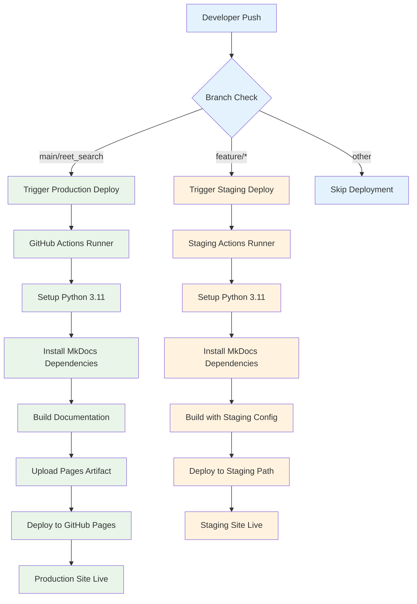

# GitHub Pages Deployment

Deploy your DataRackNews documentation to GitHub Pages for public access and team collaboration. This guide covers automated deployment using GitHub Actions.

## 🚀 Quick Setup

### 1. Enable GitHub Pages

1. **Navigate to Repository Settings**
   - Go to your GitHub repository
   - Click on **Settings** tab
   - Scroll down to **Pages** section

2. **Configure Source**
   ```
   Source: Deploy from a branch
   Branch: gh-pages
   Folder: / (root)
   ```

3. **Save Configuration**
   - Click **Save**
   - Note the generated URL: `https://yourusername.github.io/DataRackNews`

### 2. GitHub Actions Workflow

Create `.github/workflows/docs.yml`:

```yaml
name: Deploy MkDocs to GitHub Pages

on:
  push:
    branches: [ main, reet_search ]
    paths: 
      - 'docs/**'
      - 'mkdocs.yml'
      - '.github/workflows/docs.yml'
  pull_request:
    branches: [ main ]
    paths:
      - 'docs/**'
      - 'mkdocs.yml'

permissions:
  contents: read
  pages: write
  id-token: write

concurrency:
  group: "pages"
  cancel-in-progress: false

jobs:
  build:
    runs-on: ubuntu-latest
    steps:
    - name: Checkout
      uses: actions/checkout@v4
      with:
        fetch-depth: 0
    
    - name: Setup Python
      uses: actions/setup-python@v4
      with:
        python-version: '3.11'
    
    - name: Cache dependencies
      uses: actions/cache@v3
      with:
        path: ~/.cache/pip
        key: ${{ runner.os }}-pip-${{ hashFiles('**/requirements.txt') }}
        restore-keys: |
          ${{ runner.os }}-pip-
    
    - name: Install MkDocs and dependencies
      run: |
        pip install mkdocs-material
        pip install mkdocs-mermaid2-plugin
        pip install mkdocs-git-revision-date-localized-plugin
        pip install mkdocs-minify-plugin
        pip install mkdocs-redirects
    
    - name: Build documentation
      run: mkdocs build --strict --verbose
    
    - name: Upload artifact
      uses: actions/upload-pages-artifact@v2
      with:
        path: ./site

  deploy:
    environment:
      name: github-pages
      url: ${{ steps.deployment.outputs.page_url }}
    runs-on: ubuntu-latest
    needs: build
    if: github.ref == 'refs/heads/main' || github.ref == 'refs/heads/reet_search'
    steps:
    - name: Deploy to GitHub Pages
      id: deployment
      uses: actions/deploy-pages@v2
```

## 🔧 Advanced Configuration

### Custom Domain Setup

If you have a custom domain:

1. **Add CNAME file**:
   ```bash
   echo "docs.yourdomain.com" > docs/CNAME
   ```

2. **Update mkdocs.yml**:
   ```yaml
   site_url: https://docs.yourdomain.com
   ```

3. **Configure DNS**:
   ```
   Type: CNAME
   Name: docs
   Value: yourusername.github.io
   ```

### Environment-Specific Builds

```yaml
# .github/workflows/docs-staging.yml
name: Deploy Staging Docs

on:
  push:
    branches: [ develop, feature/* ]
    paths: [ 'docs/**', 'mkdocs.yml' ]

jobs:
  build-staging:
    runs-on: ubuntu-latest
    steps:
    - uses: actions/checkout@v4
    
    - name: Setup Python
      uses: actions/setup-python@v4
      with:
        python-version: '3.11'
    
    - name: Install dependencies
      run: |
        pip install mkdocs-material mkdocs-mermaid2-plugin
    
    - name: Build with staging config
      run: |
        # Add staging banner
        sed -i '1i\\n!!! warning "Staging Documentation"\n    This is staging documentation and may contain incomplete or experimental features.\n' docs/index.md
        mkdocs build
    
    - name: Deploy to staging
      uses: peaceiris/actions-gh-pages@v3
      with:
        github_token: ${{ secrets.GITHUB_TOKEN }}
        publish_dir: ./site
        destination_dir: staging
```

## 📊 Deployment Workflow



## 🛠️ Local Testing

### Preview Documentation Locally

```bash
# Install MkDocs locally
pip install mkdocs-material mkdocs-mermaid2-plugin

# Serve documentation locally
mkdocs serve

# Access at http://127.0.0.1:8000
# Auto-reloads on file changes
```

### Build Testing

```bash
# Test build process
mkdocs build --strict

# Check for broken links
mkdocs build --strict --verbose

# Clean build directory
rm -rf site/
mkdocs build
```

### Multi-version Testing

```bash
# Test different MkDocs versions
pip install mkdocs-material==9.4.0
mkdocs build

pip install mkdocs-material==9.5.0
mkdocs build
```

## 📋 Deployment Checklist

### Pre-deployment

- [ ] **Documentation Review**
  - [ ] All pages load correctly
  - [ ] Mermaid diagrams render properly
  - [ ] Internal links work
  - [ ] External links are valid

- [ ] **Configuration Check**
  - [ ] `mkdocs.yml` syntax is valid
  - [ ] All plugins are listed in dependencies
  - [ ] Site URL is correctly configured
  - [ ] Theme configuration is complete

- [ ] **Content Validation**
  - [ ] No TODO/FIXME comments in production
  - [ ] Code examples are tested
  - [ ] Screenshots are up-to-date
  - [ ] Version numbers are current

### Post-deployment

- [ ] **Verify Deployment**
  - [ ] Site loads at GitHub Pages URL
  - [ ] All sections are accessible
  - [ ] Search functionality works
  - [ ] Mobile responsiveness

- [ ] **Performance Check**
  - [ ] Page load times < 3 seconds
  - [ ] Images are optimized
  - [ ] No console errors
  - [ ] Lighthouse score > 90

## 🔍 Monitoring and Analytics

### GitHub Pages Analytics

Add Google Analytics to track documentation usage:

```yaml
# mkdocs.yml
extra:
  analytics:
    provider: google
    property: G-XXXXXXXXXX
    feedback:
      title: Was this page helpful?
      ratings:
        - icon: material/thumb-up-outline
          name: This page was helpful
          data: 1
          note: >-
            Thanks for your feedback!
        - icon: material/thumb-down-outline
          name: This page could be improved
          data: 0
          note: >-
            Thanks for your feedback! Help us improve this page by
            <a href="https://github.com/yourusername/DataRackNews/issues/new">opening an issue</a>.
```

### Deployment Status Badge

Add to your README.md:

```markdown
[](https://github.com/yourusername/DataRackNews/actions/workflows/docs.yml)
[](https://yourusername.github.io/DataRackNews)
```

## 🚨 Troubleshooting

### Common Issues

#### 1. Build Failures

```bash
# Error: Plugin 'mermaid2' not found
# Solution: Add to workflow
pip install mkdocs-mermaid2-plugin
```

#### 2. 404 Errors

```bash
# Error: Page not found
# Check mkdocs.yml navigation structure
nav:
  - Home: index.md
  - Getting Started:
    - Overview: getting-started/overview.md  # Ensure file exists
```

#### 3. Mermaid Diagrams Not Rendering

```yaml
# Ensure plugin is properly configured
plugins:
  - mermaid2:
      arguments:
        theme: base
        themeVariables:
          primaryColor: '#ff0000'
```

#### 4. Deployment Permissions

```yaml
# Ensure proper permissions in workflow
permissions:
  contents: read
  pages: write
  id-token: write
```

### Debug Mode

Enable debug mode for detailed logs:

```yaml
# In GitHub Actions workflow
- name: Build documentation with debug
  run: mkdocs build --strict --verbose --config-file mkdocs.yml
  env:
    MKDOCS_DEBUG: 1
```

### Performance Optimization

```yaml
# mkdocs.yml optimizations
plugins:
  - search:
      lang: en
      separator: '[\s\-,:!=\[\]()"/]+|(?!\b)(?=[A-Z][a-z])|\.(?!\d)|&[lg]t;'
  - minify:
      minify_html: true
      minify_js: true
      minify_css: true
      htmlmin_opts:
        remove_comments: true
        remove_empty_space: true
  - git-revision-date-localized:
      enable_creation_date: true
      type: datetime
```

## 📈 Success Metrics

Track these metrics for your documentation site:

| Metric | Target | Measurement |
|--------|--------|-------------|
| **Page Load Time** | < 3s | Google PageSpeed Insights |
| **Uptime** | > 99.5% | GitHub Pages status |
| **User Engagement** | > 2 min avg | Google Analytics |
| **Search Success** | > 80% | MkDocs search analytics |
| **Mobile Score** | > 90 | Lighthouse mobile audit |

## 🔄 Continuous Improvement

### Automated Updates

```yaml
# .github/workflows/update-docs.yml
name: Update Documentation

on:
  schedule:
    - cron: '0 2 * * 1'  # Weekly on Monday at 2 AM
  workflow_dispatch:

jobs:
  update:
    runs-on: ubuntu-latest
    steps:
    - uses: actions/checkout@v4
    
    - name: Update dependencies
      run: |
        pip install --upgrade mkdocs-material
        pip freeze > docs-requirements.txt
    
    - name: Check for broken links
      run: |
        pip install linkchecker
        mkdocs build
        linkchecker --check-extern site/
    
    - name: Create PR if updates available
      uses: peter-evans/create-pull-request@v5
      with:
        title: 'docs: Update dependencies and fix broken links'
        body: 'Automated update of documentation dependencies'
        branch: docs/automated-updates
```

Your DataRackNews documentation is now ready for professional deployment with GitHub Pages! 🚀