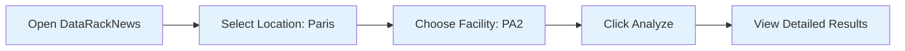
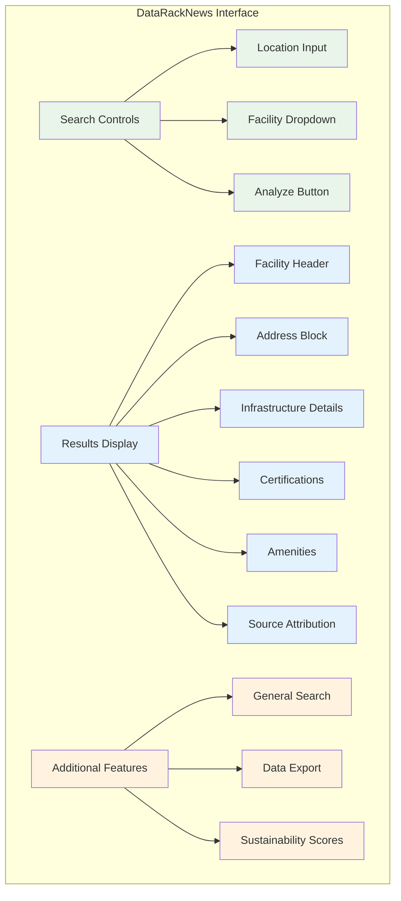
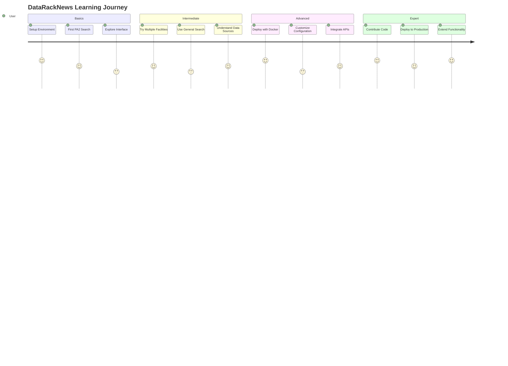

# Getting Started with DataRackNews

Welcome to DataRackNews! This guide will help you get up and running with our data center intelligence platform quickly and efficiently.

## 🎯 What You'll Learn

By the end of this guide, you'll be able to:

- ✅ Set up DataRackNews locally or with Docker
- ✅ Perform your first data center search
- ✅ Extract detailed facility information (like PA2)
- ✅ Understand the core features and capabilities
- ✅ Navigate the documentation effectively

## 🚀 Quick Start Options

Choose your preferred setup method:

=== "🐳 Docker (Recommended)"
    **Best for**: Production deployments, consistent environments
    
    ```bash
    # Clone and setup
    git clone https://github.com/Reetika12795/DataRackNews.git
    cd DataRackNews
    
    # One-command deployment
    ./start-docker.sh
    
    # Access the application
    open http://localhost:7860
    ```
    
    **Time to setup**: ~5 minutes

=== "🐍 Local Python"
    **Best for**: Development, customization
    
    ```bash
    # Clone and setup
    git clone https://github.com/Reetika12795/DataRackNews.git
    cd DataRackNews
    
    # Create virtual environment
    python -m venv .venv
    source .venv/bin/activate  # On Windows: .venv\Scripts\activate
    
    # Install dependencies
    pip install -r requirements.txt
    
    # Run the application
    python gradio_ui.py
    ```
    
    **Time to setup**: ~10 minutes

=== "☁️ Cloud Deployment"
    **Best for**: Team access, production scale
    
    ```bash
    # Deploy to your cloud provider
    # See deployment guides for:
    # - AWS EC2/ECS
    # - Google Cloud Run
    # - Azure Container Instances
    # - Railway/Render/Heroku
    ```
    
    **Time to setup**: ~20 minutes

## 🔧 Prerequisites

### System Requirements

| Component | Minimum | Recommended |
|-----------|---------|-------------|
| **OS** | Linux, macOS, Windows 10+ | Any modern OS |
| **Python** | 3.9+ | 3.11+ |
| **Memory** | 2GB RAM | 4GB+ RAM |
| **Storage** | 1GB free | 5GB+ free |
| **Network** | Internet connection | Stable broadband |

### Required Tools

=== "Docker Setup"
    - **Docker Desktop** (macOS/Windows) or **Docker Engine** (Linux)
    - **Docker Compose** (included with Docker Desktop)
    - **Git** for cloning the repository

=== "Local Setup"
    - **Python 3.9+** with pip
    - **Git** for cloning the repository
    - **Virtual environment** support (venv/conda)

### API Keys (Optional)

For enhanced search capabilities:

```bash
# SERP API key (for advanced search features)
export SERP_API_KEY="your_serp_api_key_here"

# Or create .env file:
echo "SERP_API_KEY=your_serp_api_key_here" > .env
```

!!! tip "Free Tier Available"
    DataRackNews works without API keys for basic Equinix facility extraction. SERP API enhances general data center search capabilities.

## 🎮 Your First Search

Let's perform your first data center search to see DataRackNews in action:

### 1. Launch the Application

After setup, navigate to `http://localhost:7860` in your browser.

### 2. Perform PA2 Search (Flagship Feature)



**Step-by-step**:
1. **Location**: Type or select "Paris" in the location field
2. **Facility**: Choose "PA2" from the dropdown (index 1)
3. **Analyze**: Click the "Analyze Equinix Datacenter" button
4. **Results**: See comprehensive PA2 facility information

### 3. Expected Results

You should see detailed information like:

```
🏢 **PA2 - Equinix PA2**

📍 **Address**: 114 Rue Ambroise Croizat, Saint Denis, France, 93200

⚡ **Power**: N+1 electrical redundancy
🌡️ **Cooling**: N+1 cooling redundancy  

📜 **Certifications**: 13 certifications including:
• ISO 27001, ISO 9001, ISO 14001
• SOC 1 Type II, SOC 2 Type II
• PCI DSS, GDPR Compliant

🏪 **Amenities**: 5 amenities including:
• 24/7 Remote Hands
• Conference Rooms
• Customer Lounge

🌐 **Source**: https://www.equinix.com/data-centers/.../pa2
```

## 🧭 Understanding the Interface



### Key Interface Elements

| Element | Purpose | Example |
|---------|---------|---------|
| **Location Input** | Target city/region | "Paris", "Frankfurt", "London" |
| **Facility Dropdown** | Specific facility selection | "PA2", "FR5", "LD8" |
| **Analyze Button** | Trigger detailed extraction | Click to start analysis |
| **Results Panel** | Display facility information | Comprehensive data output |
| **General Search** | Broader data center search | "Frankfurt data centers" |

## 📚 Learning Path

Follow this recommended path to master DataRackNews:



### Learning Resources

1. **[PA2 Enhancement Guide](../features/pa2-enhancement.md)** - Deep dive into our flagship feature
2. **[System Architecture](../architecture/system-overview.md)** - Understand how it all works
3. **[Docker Deployment](../deployment/docker.md)** - Production-ready deployment
4. **[API Workflows](../api/workflows.md)** - Technical integration details

## 🏃‍♂️ Next Steps

### Immediate Actions

1. **Explore More Facilities**
   ```bash
   # Try these popular facilities:
   - London LD8 (UK financial hub)
   - Frankfurt FR5 (German digital gateway) 
   - Amsterdam AM3 (European internet exchange)
   - New York NY1 (US financial district)
   ```

2. **Test General Search**
   ```bash
   # Search examples:
   - "Frankfurt data centers"
   - "London colocation facilities" 
   - "Amsterdam cloud providers"
   - "sustainable data centers Europe"
   ```

3. **Review Configuration**
   ```bash
   # Check your setup:
   - Verify all services are running
   - Test database connectivity
   - Confirm cache is working
   - Validate API integrations
   ```

### Deeper Exploration

- **[Features Overview](../features/equinix-scraping.md)** - Discover all capabilities
- **[Deployment Options](../deployment/local.md)** - Choose your deployment strategy
- **[Development Guide](../development/contributing.md)** - Start contributing

## 🆘 Need Help?

### Common Issues

=== "Docker Issues"
    **Problem**: Docker daemon not running
    ```bash
    # Solution (macOS):
    open -a Docker
    
    # Wait for Docker to start, then:
    ./start-docker.sh
    ```

=== "Port Conflicts"
    **Problem**: Port 7860 already in use
    ```bash
    # Check what's using the port:
    lsof -i :7860
    
    # Kill the process or change port in docker-compose.yml
    ```

=== "API Errors"
    **Problem**: No results or errors
    ```bash
    # Check logs:
    docker compose logs app
    
    # Verify API keys in .env file
    ```

### Getting Support

- **GitHub Issues**: [Report bugs or request features](https://github.com/Reetika12795/DataRackNews/issues)
- **Discussions**: [Ask questions and share ideas](https://github.com/Reetika12795/DataRackNews/discussions)
- **Documentation**: Browse this comprehensive guide
- **Examples**: Check the `examples/` directory in the repository

## 🎉 Success Checklist

Before moving on, ensure you can:

- [ ] **Launch DataRackNews** locally or via Docker
- [ ] **Search for PA2** and see detailed facility information
- [ ] **Navigate the interface** comfortably
- [ ] **Understand the data sources** and accuracy
- [ ] **Access the documentation** for deeper learning

## 🚀 Ready for More?

Congratulations! You've successfully set up DataRackNews and performed your first facility search. You're now ready to:

- **Explore Advanced Features**: Dive into our comprehensive facility analysis
- **Deploy to Production**: Set up a scalable deployment for your team
- **Integrate with Your Workflow**: Use our APIs for custom applications
- **Contribute**: Help improve DataRackNews for the community

**Next Recommended Reading**: [PA2 Enhancement Deep Dive](../features/pa2-enhancement.md) to understand what makes DataRackNews unique! 🌟