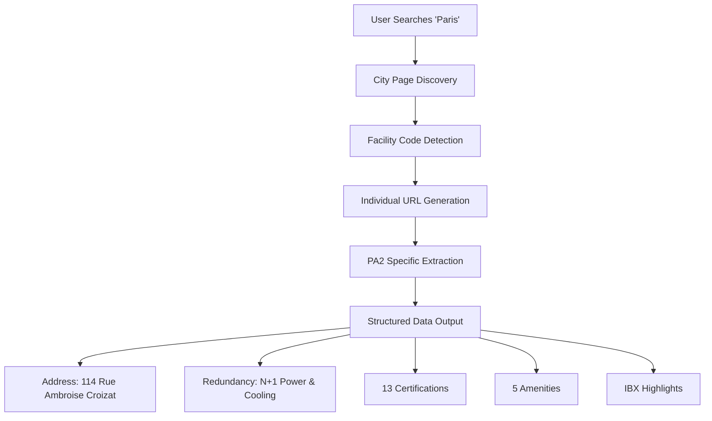
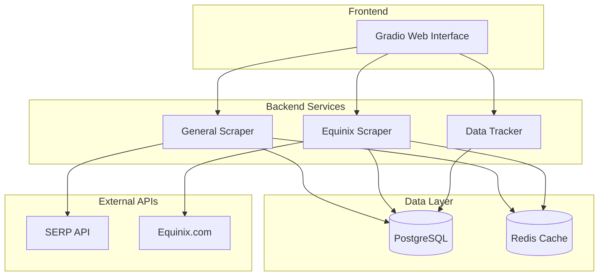

# DataRackNews Documentation

Welcome to the comprehensive documentation for **DataRackNews** - a real-time data center intelligence and monitoring platform.


## 🚀 What is DataRackNews?

DataRackNews is a cutting-edge web application that provides real-time intelligence about data centers worldwide. Built with a focus on Equinix facilities, it offers detailed facility information, sustainability metrics, and market intelligence through an intuitive Gradio web interface.

### Key Highlights

=== "🌍 Global Coverage"
    - **Multi-Provider Support**: Search across various data center providers
    - **Equinix Specialization**: Deep integration with Equinix facilities
    - **Real-time Data**: Fresh information extracted from official sources
    - **Geographic Search**: Find facilities by city, country, or region

=== "🏢 Detailed Intelligence"
    - **Facility Specifications**: Address, power, cooling, space details
    - **Compliance Tracking**: ISO standards, SOC, PCI DSS certifications
    - **Amenities**: Conference rooms, technical services, connectivity
    - **Sustainability**: Environmental impact and green initiatives

=== "📊 Advanced Analytics"
    - **Scoring Systems**: Sustainability and connectivity metrics
    - **Market Intelligence**: Carrier counts, enterprise presence
    - **Comparative Analysis**: Side-by-side facility comparisons
    - **Interactive Visualizations**: Charts, maps, and data tables

=== "🐳 Modern Deployment"
    - **Docker Containerization**: Easy deployment and scaling
    - **Multi-service Architecture**: Web app, database, caching
    - **Production Ready**: Health checks, monitoring, persistence
    - **Cross-platform**: Linux, macOS, Windows support

## 🎯 Special Features

### Enhanced PA2 Extraction
Our crown jewel is the enhanced extraction system that can pull detailed information from specific Equinix facilities like PA2:



### Real-time Web Scraping
Advanced scraping capabilities with multiple fallback mechanisms:

- **Pattern Matching**: Intelligent regex patterns for data extraction
- **URL Generation**: Dynamic URL construction for different regions
- **Fallback Systems**: Multiple strategies when primary URLs fail
- **Rate Limiting**: Respectful scraping with built-in delays

## 🏗️ Architecture Overview



## 📚 Navigation Guide

This documentation is organized into several main sections:

| Section | Description |
|---------|-------------|
| **[Getting Started](getting-started/overview.md)** | Quick setup and installation guides |
| **[Architecture](architecture/system-overview.md)** | System design and component diagrams |
| **[Features](features/equinix-scraping.md)** | Detailed feature documentation |
| **[API Reference](api/scrapers.md)** | Technical API and workflow documentation |
| **[Deployment](deployment/local.md)** | Local and production deployment guides |
| **[Development](development/contributing.md)** | Contributing and development guidelines |

## 🚀 Quick Start

Ready to get started? Here's the fastest way to deploy DataRackNews:

!!! tip "Docker Deployment (Recommended)"
    ```bash
    git clone https://github.com/Reetika12795/DataRackNews.git
    cd DataRackNews
    cp .env.example .env
    # Edit .env with your SERP_API_KEY
    ./start-docker.sh
    docker compose up -d
    # Visit http://localhost:7860
    ```

!!! info "Local Development"
    ```bash
    git clone https://github.com/Reetika12795/DataRackNews.git
    cd DataRackNews
    python -m venv .venv
    source .venv/bin/activate
    pip install -r requirements.txt
    python gradio_ui.py
    ```

## 🎓 Learning Path

New to DataRackNews? Follow this recommended learning path:

1. **[Overview](getting-started/overview.md)** - Understand the project scope
2. **[Installation](getting-started/installation.md)** - Set up your environment
3. **[System Overview](architecture/system-overview.md)** - Learn the architecture
4. **[PA2 Enhancement](features/pa2-enhancement.md)** - See our flagship feature
5. **[Docker Deployment](deployment/docker.md)** - Deploy in production

## 🤝 Community

- **GitHub**: [Reetika12795/DataRackNews](https://github.com/Reetika12795/DataRackNews)
- **Issues**: Report bugs and request features
- **Discussions**: Ask questions and share ideas
- **Branch**: Development happens on `reet_search`

---

**Ready to explore the world of data center intelligence? Let's get started!** 🚀